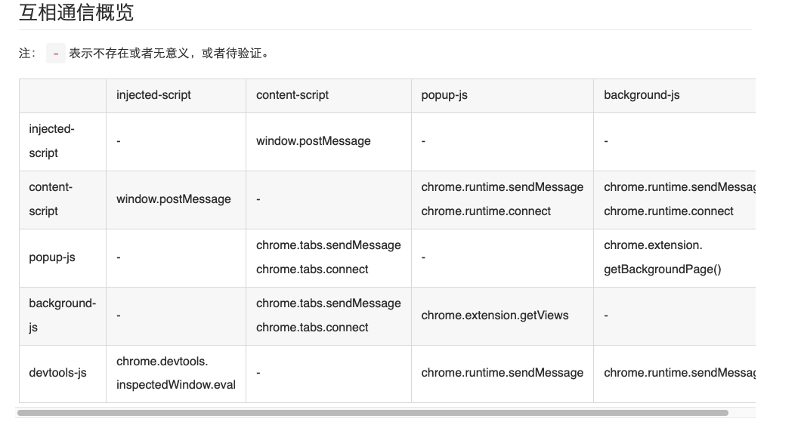
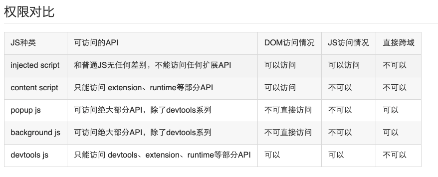

### 请简述浏览器插件的基本原理是什么？

拦截页面js dom 请求，注入js，css等，然后进行一系列操作。（大概）

### 请列举一些常见的浏览器插件类型，并简述它们的作用。

browserAction(浏览器右上角)

pageAction(地址栏右侧)

右键菜单

override(覆盖特定页面)

devtools(开发者工具)

option(选项页)

omnibox

桌面通知

### 请描述浏览器插件的生命周期，并说明每个阶段的作用。

请简述浏览器插件与页面的通信方式，并说明它们的优缺点。



### 请说明如何在浏览器插件中使用 AJAX 进行异步请求。



先在/manifest.json的permissions字段中声明"webRequest", // web请求、"webRequestBlocking", // 阻塞式web请求权限，

```text
// 每次请求前触发，可以拿到 requestBody 数据，同时可以对本次请求作出干预修改
chrome.webRequest.onBeforeRequest.addListener(details => {
 console.log('onBeforeRequest', details);
}, {urls: ['<all_urls>']}, ['blocking', 'extraHeaders', 'requestBody']);
// 发送header之前触发，可以拿到请求headers，也可以添加、修改、删除headers
// 但使用有一定限制，一些特殊头部可能拿不到或者存在特殊情况，详见官网文档
chrome.webRequest.onBeforeSendHeaders.addListener(details => {
 console.log('onBeforeSendHeaders', details);
}, {urls: ['<all_urls>']}, ['blocking', 'extraHeaders', 'requestHeaders']);
// 开始响应触发，可以拿到服务端返回的headers
chrome.webRequest.onResponseStarted.addListener(details => {
 console.log('onResponseStarted', details);
}, {urls: ['<all_urls>']}, ['extraHeaders', 'responseHeaders']);
// 请求完成触发，能拿到的数据和onResponseStarted一样，注意无法拿到responseBody
chrome.webRequest.onCompleted.addListener(details => {
 console.log('onCompleted', details);
}, {urls: ['<all_urls>']}, ['extraHeaders', 'responseHeaders']);
```

### 请描述浏览器插件的安全问题，并列举一些常见的攻击方式。

### 请说明如何在浏览器插件中实现跨域请求。

popup.js background.js中发起ajax请求.

### 请简述浏览器插件的打包和发布流程，并说明需要注意的事项。

打成crx包，然后登陆谷歌账号进行发布。

### 请描述如何在浏览器插件中使用本地存储。

1、manifest声明权限，
2、使用 storage api。

### 请说明如何在浏览器插件中实现国际化。

1. 定义语种
   如果manifest.json里配置了default_locale属性，chrome就会去根目录寻找_locale下对应的语种，比如中文简体为：_
   locale/zh_CN/messages.json，具体格式上面有简单提到。

chrome扩展支持的所有语种：am ar bg bn ca cs da de el en en_GB en_US es es_419 et fi fil fr gu he hi hr hu id it ja kn ko
ltlv ml mr nl or pl pt pt_BR pt_PT ro ru sk sl sr sv sw ta te th tr uk vi zh zh_CN zh_TW。

2. 调用
   ① 在js中调用
   chrome.i18n.getMessage('name')

这里的getMessage还支持第2个参数，用于占位，可带入变量。用法如下：

```text
//messages.json定义
{
"hello": {
"message": "你好, $USER$",
"placeholders": {
"user": {
"content": "$1",
"example": "李四"
}
}
}
}
```

//js调用
const msg = chrome.i18n.getMessage('hello','张三')
② 在manifest.json或css中调用

使用字符变量__MSG_xxxx__，或调用方法getMessage("_xxxx_")：

```text
//manifest.json:
{
"name": "__MSG_name__",
"description": "__MSG_desc__",
"default_locale" : "zh_CN",
"manifest_version": 2,
...
}


// css:
#app{
width: __MSG_width__;
}

```


写到这里出现一个问题，如果你使用chrome.i18n.getMessage，用户想切换语言，除了在浏览器设置语种后重启，暂时还没发现热切换的方法。我的做法是除非必要，尽量避免使用chrome.i18n.getMessage，通过vue+element-ui那套方式来实现，并把选中的语种保存在缓存中，还可供后端接口调用，这就引出了下面这种场景。

前端可把语种封装到headers统一传给后端，就像这样：
