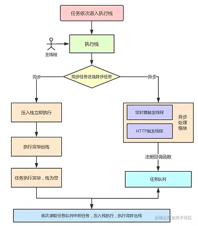

## 什么是event loop

一种事件循环机制。

首先任务分为同步任务和异步任务，异步任务又分为宏任务和微任务，event loop就是描述如何处理这些任务的一种处理机制。

#### 微任务都有哪些？
* process.nextTick (Node独有)
* Promise
* Object.observe
* MutationObserver

#### 宏任务都有哪些？

* setTimeout
* setInterval
* setImmediate (Node独有)
* requestAnimationFrame (浏览器独有)
* I/O
* UI rendering (浏览器独有)

> 浏览器和node中有区分

### 浏览器中的event loop

先借用一张图


> tip：队列是一种先进先出的数据结构
> 
> 所有微任务都执行完毕后才会去执行下一个宏任务
> 
> 如果在执行微任务中又产生了微任务，那么微任务也会加入到微任务队列中等待执行。
>
> 图中没有ui rendering的节点，它是由浏览器自行判断决定的，只要执行UI rendering，它的节点是在执行完所有的microtask之后，下一个macrotask之前，紧跟着执行UI render。


js执行时，如果遇到同步任务就直接执行，遇到宏任务就先把它放到宏任务队列中等待执行，遇到微任务就先把它放到微任务队列中等待执行，然后依次从宏任务队列中依次取出宏任务执行，一次宏任务执行完毕后，先去检查微任务队列中有没有要执行的微任务，有的话依次全部执行完毕后再去执行下一个宏任务。


当某个宏任务执行完后,会查看是否有微任务队列。如果有，先执行微任务队列中的所有任务，如果没有，会读取宏任务队列中排在最前的任务，执行宏任务的过程中，遇到微任务，依次加入微任务队列。栈空后，再次读取微任务队列里的任务，依次类推。

字多不看系列：



### 测试题

```js
console.log(1);

setTimeout(() => {
  console.log(2);
  Promise.resolve().then(() => {
    console.log(3)
  });
});

new Promise((resolve, reject) => {
  console.log(4)
  resolve(5)
}).then((data) => {
  console.log(data);
})

setTimeout(() => {
  console.log(6);
})

console.log(7);
// 1 4 7 5 5 2 3 6
```

```js
console.log(1);

setTimeout(() => {
  console.log(2);
  Promise.resolve().then(() => {
    console.log(3)
  });
});

new Promise((resolve, reject) => {
  console.log(4)
  resolve(5)
}).then((data) => {
  console.log(data);
  
  Promise.resolve().then(() => {
    console.log(6)
  }).then(() => {
    console.log(7)
    
    setTimeout(() => {
      console.log(8)
    }, 0);
  });
})

setTimeout(() => {
  console.log(9);
})

console.log(10);
 // 1 4 10 5 6 7 2 3 9 8
```

```js
async function async1() {
  console.log('async1 start');
  await async2();
  console.log('async1 end');
}
async function async2() {
  console.log('async2');
}
console.log('script start');
setTimeout(function() {
  console.log('setTimeout');
}, 0);
async1();
new Promise(function(resolve) {
  console.log('promise1');
  resolve();
}).then(function() {
  console.log('promise2');
});
console.log('script end');
```

async await

```js
async function foo() {
    // await 前面的代码
    console.log(1);
    await bar();
    console.log(2);
    // await 后面的代码
}
// 等价于
function foo() {
  // await 前面的代码
    console.log(1);
    Promise.resolve(bar()).then(() => {
    // await 后面的代码
      console.log(2);
  });
}
```

### node中event loop

node11.x之后和浏览器端统一了

```js
setTimeout(()=>{
    console.log('timer1')
    Promise.resolve().then(function() {
        console.log('promise1')
    })
}, 0)
setTimeout(()=>{
    console.log('timer2')
    Promise.resolve().then(function() {
        console.log('promise2')
    })
}, 0)
```
Node端运行结果分两种情况：

* 如果是node11版本一旦执行一个阶段里的一个宏任务(setTimeout,setInterval和setImmediate)就立刻执行微任务队列，这就跟浏览器端运行一致，最后的结果为timer1=>promise1=>timer2=>promise2
* 如果是node10及其之前版本：要看第一个定时器执行完，第二个定时器是否在完成队列中。

如果是第二个定时器还未在完成队列中，最后的结果为timer1=>promise1=>timer2=>promise2
如果是第二个定时器已经在完成队列中，则最后的结果为timer1=>timer2=>promise1=>promise2(下文过程解释基于这种情况下)


### 思考

promise嵌套多个.then如何执行

```js
new Promise((resolve, reject) => {
        console.log('promise1');
        resolve();
    })
        .then(() => {
            console.log('then11');
            new Promise((resolve, reject) => {
                console.log('promise2');
                resolve();
            })
                .then(() => {
                    console.log('then21');
                })
                .then(() => {
                    console.log('then23');
                })
                .then(() => {
                    console.log('then24');
                });
        })
        .then(() => {
            console.log('then12');
        })
        .then(() => {
            console.log('then13');
        });
/*
* promise1
 then11
 promise2
 then21
 then12
 then23
 then13
 then24
* 
* */
```


