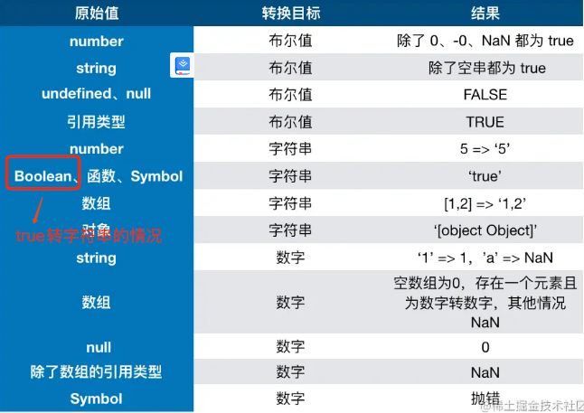
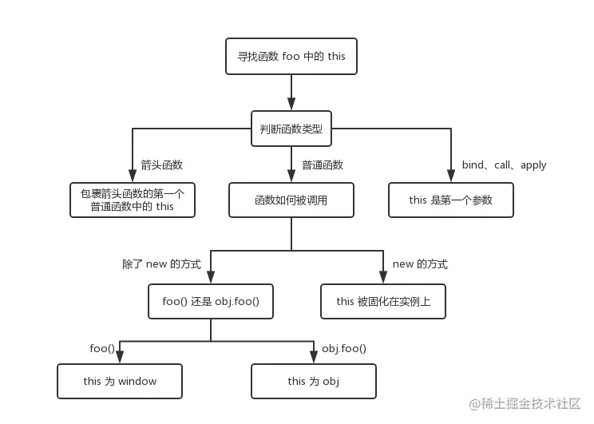

1、数据类型：
 原始类型（基本数据类型）：string,number,boolean,null,undefined,symbol,bigint

bigint 解决 js中精度损失问题： 0.1 + 0.2 === 0.3 => false

精度损失原因: js采用双精度存储，1位用来表示符号位 11位用来表示指数 52位表示尾数，
存储时模仿十进制进行四舍五入了，但是二进制只有 0 和 1 两个，于是变为 0 舍 1 入，
由于存储位数限制因此存在“舍去”，精度丢失就发生了。
解决思想：
1、把小数放到位整数（乘倍数），再缩小回原来倍数（除倍数），这种方式依然存在问题，转换后的整数依然不能超过2的53次方。
2、toFixed，舍弃掉尾数。

 ```js
// toFixed 修复
function toFixed(num, s) {
 var times = Math.pow(10, s)
 var des = num * times + 0.5
 des = parseInt(des, 10) / times
 return des + ''
}
```

bigint：

创建方式： 
```js
console.log(9007199254740995n);    // → 9007199254740995n
console.log(9007199254740995);     // → 9007199254740996

BigInt("9007199254740995");    // → 9007199254740995n
```

不能使用严格相等运算符将BigInt与常规数字进行比较，因为它们的类型不同：
```js
console.log(10n === 10);    // → false

console.log(typeof 10n);    // → bigint
console.log(typeof 10);     // → number
```

可以使用等号运算符，它在处理操作数之前执行隐式类型转换
```js
console.log(10n == 10);    // → true
```
不能使用Number和BigInt操作数的混合执行算术运算，需要通过显式转换其中的一种类型。 此外，出于兼容性原因，不允许在BigInt上使用一元加号（+）运算符。


### 数据类型判断
typeof：
 可以准确的判断基本数据类型
 引用数据类型除了function都输出object，typeof function => function
 特别注意（typeof null ==> object）

instanceof：通过原型链的方式来判断是否为构建函数的实例，常用于判断具体的对象类型
 > Symbol.hasInstance可以让自定义instanceof行为，
```js
class PrimitiveString {
  static [Symbol.hasInstance](x) {
    return typeof x === 'string'
  }
}
console.log('hello world' instanceof PrimitiveString) // true
// 等同于 typeof 'hello world' === 'string'
```

构造函数判断：[].constructor === Array

最佳方案：
Object.prototype.toString.call()
```js
    Object.prototype.toString.call(null) // [object Null]
    Object.prototype.toString.call(1) // [object Number]
    Object.prototype.toString.call("1") // [object String]
    Object.prototype.toString.call(undefined) // [object Undefined]
    Object.prototype.toString.call(true) // [object Boolean]
    Object.prototype.toString.call(1n)  // [object BigInt]
    Object.prototype.toString.call([]); // [object Array]
    Object.prototype.toString.call({}); // [object Object]
    Object.prototype.toString.call(function () {});// [object Function]
```

### 类型转换
类型转换存在三种情况；
1、转布尔值 
2、转数字
3、转字符串


> 布尔值转string直接转换， true => "true" false => "false"

#### 转布尔值
 undefined,null,false,NaN,'',0,-0 => 都为false
 其他情况都会转换成true，空对象也为true。

对象转基本类型

对象在转换类型的时候，会调用内置的 [[ToPrimitive]] 函数： 

* 如果已经是原始类型了，那就不需要转换了
* 如果需要转字符串类型就调用 x.toString()，转换为基础类型的话就返回转换的值。不是字符串类型的话就先调用 valueOf，结果不是基础类型的话再调用 toString
* 调用 x.valueOf()，如果转换为基础类型，就返回转换的值
* 如果都没有返回原始类型，就会报错

```js
//  重写 Symbol.toPrimitive
let a = {
  valueOf() {
    return 0
  },
  toString() {
    return '1'
  },
  [Symbol.toPrimitive]() {
    return 2
  }
}
1 + a // => 3
```

### 四则运算

~ 加法运算符存在隐式类型转换
* 如果一方为字符串，另一方也被转换为字符串然后尝试相加
* 如果一方不是字符串或者数字，会把它转换成字符串或者数字然后尝试相加。
```js
1 + '1' // '11'
true + true // 2
4 + [1,2,3] // "41,2,3"
```

~ 除了加法的运算符来说
* 只要其中一方是数字，那么另一方就会被转为数字
* 计算前都会转换成number类型后再进行计算，如果转换失败就会输出NaN(not a number)
```js
4 * '3' // 12
"4" * '3' // 12
"4a" * '3' // NaN
"4" * true // 1
"4" * false // 0
4 * [] // 0
4 * [1, 2] // NaN
```

~ 比较运算符
* 如果是对象，就通过 toPrimitive 转换对象
* 如果是字符串，就通过 unicode 字符索引来比较
  
```js
let a = {
  valueOf() {
    return 0
  },
  toString() {
    return '1'
  }
}
a > -1 // true
//因为 a 是对象，所以会通过 valueOf 转换为原始类型再比较值。
```

### this
总之一句话谁调用了函数，this就指向谁

严格模式下this有所不同
http://www.ruanyifeng.com/blog/2013/01/javascript_strict_mode.html
https://segmentfault.com/a/1190000010108912
严格模式：https://developer.mozilla.org/zh-CN/docs/Web/JavaScript/Reference/Strict_mode


改变this指向： call bind apply

bind 这些改变上下文的 API 了，对于这些函数来说，this 取决于第一个参数，如果第一个参数为空，那么就是 window

如果对一个函数进行多次 bind
```js
let a = {}
let fn = function () { console.log(this) }
fn.bind().bind(a)() // => ?
// fn.bind().bind(a) 等于
let fn2 = function fn1() {
 return function() {
  return fn.apply()
 }.apply(a)
}
fn2()
//  不管我们给函数 bind 几次，fn 中的 this 永远由第一次 bind 决定，所以结果永远是 window。
```

首先，new 的方式优先级最高，接下来是 bind 这些函数，然后是 obj.foo() 这种调用方式，最后是 foo 这种调用方式，同时，箭头函数的 this 一旦被绑定，就不会再被任何方式所改变。


