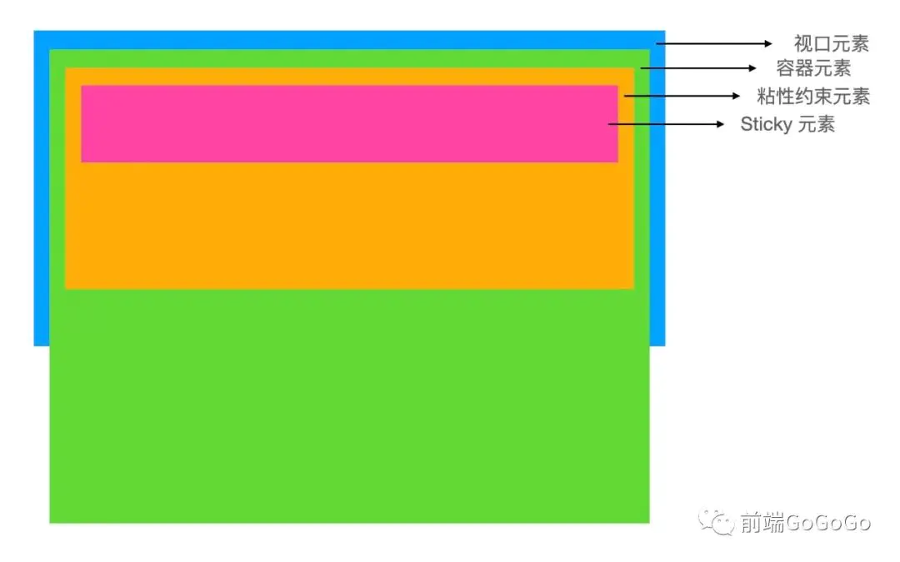

为便于理解粘性定位，这里引入四个元素：视口元素，容器元素，粘性约束元素 和 sticky 元素。它们的关系如下：

视口元素：显示内容的区域。会设置宽，高。一般会设置 overflow:hidden。
容器元素：离 sticky 元素最近的能滚动的祖先元素。
粘性约束元素：粘性定位的父元素。有时，也会出现粘性约束元素就是容器元素的情况。
sticky 元素：设置了 position: sticky; 的元素。

滚动时，sticky 元素设置的 left, right, top, bottom 的值相对的是容器元素。当粘性约束元素滚出视口时，sticky 元素也会滚出视口。